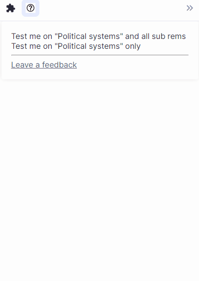
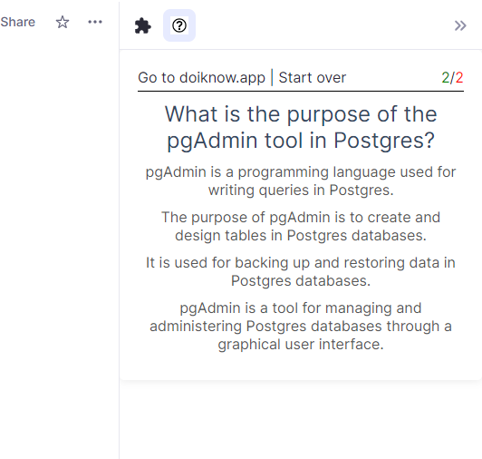
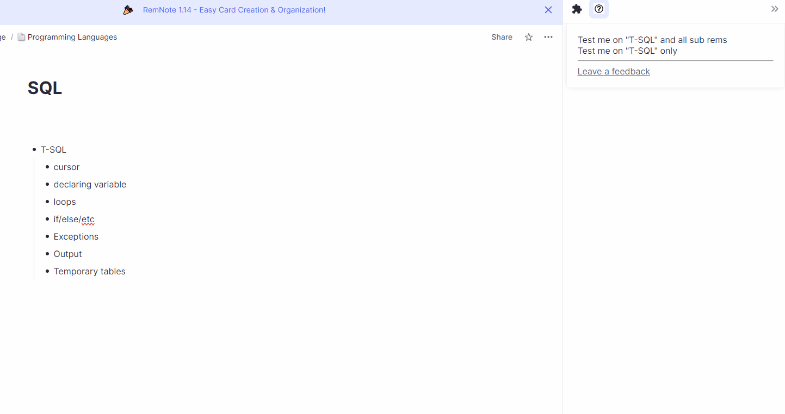

# RemNote-DoIKnow

DoIKnow allows you to test yourself on any topic from your knowledge base.

You don't have to come up with a list of questions by yourself; DoIKnow will do it for you.

It makes the learning process more fun and removes the tedious part where you have to create questions manually, which could be a huge psychological barrier and mentally exhausting.

Questions generated by the external tool help you to identify gaps in your knowledge as well, highlighting important topics you might have missed.

## How it works

#### TLDR
- Install DoIKnow Plugin
- Open right sidebar
- Click on the icon with DoIKnow. 
- Click on any rem and then just follow the instructions in the plugin.

The first step is to install the plugin. Go to settings -> Plugins, find the DoIKnow plugin in the search and click install.
After installing the plugin, it should become available on the right sidebar.

Activate the plugin by clicking the DoIKnow icon and select a topic for testing.

Open any document/rem, click on your chosen rem, and decide whether to be quizzed on just that rem or include its related subrems. 
This choice tailors the quiz to your specific learning goals, usually generating a concise set of 10 questions, with potential for adjustment as the service evolves.

At the top bar, you'll find two helpful links:

Start Over: To explore a new topic.

Go to DoIKnow: For those preferring the website's broader testing environment. This generates a link for easy access later, despite the current variability of these links. Future updates aim for permanency.

Here you can see how it works:

## Your feedback matters 
Please feel free to leave your feedback and comments.

The current version is just an attempt to understand what value it might bring to the learning journey.

The evolution of DoIKnow is driven by your insights and participation

